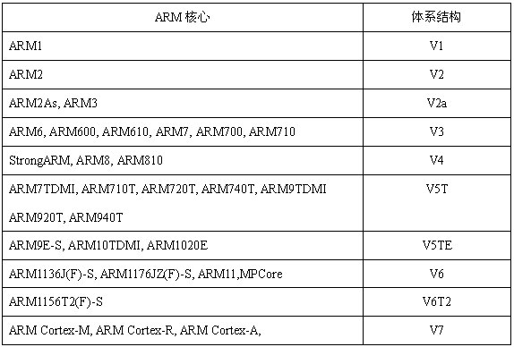

# ARM 体系架构

## 1.ARM

ARM即以英国ARM（Advanced RISC Machines）公司的内核芯片作为CPU，同时附加其他外围功能的嵌入式开发板，用以评估内核芯片的功能和研发各科技类企业的产品.

RISC （Reduced Instruction Set Computer），精简指令集；

> － ARM7 系列 
> － ARM9 系列 
> － ARM9E 系列 
> － ARM10E 系列 
> － ARM11系列 
> － Cortex 系列 
> － SecurCore 系列 
> － OptimoDE Data Engines 
> － Intel的Xscale 
> － Intel的StrongARM ARM11系列

## 2、ARM 版本号

- 内核版本号（指令集版本号）：ARMv7 等等；
- ARM 的SOC 版本号： Cortex-A8, ARM9 等等；
- 芯片型号： S5PV210 等等；

## 3. Cortex 系列

- Cortex-M 单片机，低功耗

  - Cortex-M0
  - Cortex-M0+
  - Cortex-M3
  - Cortex-M4 （stm32f407 -- 8128）

- Cortex-R   实时性好；

  - Cortex-R4
  - Cortex-R5
  - Cortex-R7

- Cortex-A 高性能，手机等等；

  - Cortex-A5
  - Cortex-A7
  - Cortex-A8
  - Cortex-A9 （8388 Linux 平台）
  - Cortex-A15
  - Cortex-A50

  注：8388， ARM v7, Cortex-A9

  ​		FPGA:  Contex-A9

  ​		Stm32f407:  Contex-M4z

## 4、arm 交叉编译工具

### 4.1、命名规则

交叉编译工具链的命名规则为：**arch [-vendor] [-os] [-(gnu)eabi]**

- **arch** - 体系架构，如ARM，MIPS
- **vendor** - 工具链提供商
- **os** - 目标操作系统
- **eabi** - 嵌入式应用二进制接口（Embedded Application Binary Interface）

根据对操作系统的支持与否，ARM GCC可分为支持和不支持操作系统，如

- **arm-none-eabi**：这个是没有操作系统的，自然不可能支持那些跟操作系统关系密切的函数，比如fork(2)。他使用的是newlib这个专用于嵌入式系统的C库。
- **arm-none-linux-eabi**：用于Linux的，使用Glibc

### 4.2、实例

#### **4.2.1、arm-none-eabi-gcc**

（ARM architecture，no vendor，not target an operating system，complies with the ARM EABI）
 用于编译 ARM 架构的裸机系统（包括 ARM Linux 的 boot、kernel，不适用编译 Linux 应用 Application），一般适合 ARM7、Cortex-M 和 Cortex-R 内核的芯片使用，所以不支持那些跟操作系统关系密切的函数，比如fork(2)，他使用的是 newlib 这个专用于嵌入式系统的C库。

#### **4.2.2、arm-none-linux-gnueabi-gcc**

(ARM architecture, no vendor, creates binaries that run on the **Linux** operating system, and uses the GNU EABI)

主要用于基于ARM架构的Linux系统，可用于编译 ARM 架构的 u-boot、Linux内核、linux应用等。arm-none-linux-gnueabi基于GCC，使用Glibc库，经过 Codesourcery 公司优化过推出的编译器。arm-none-linux-gnueabi-xxx 交叉编译工具的浮点运算非常优秀。一般ARM9、ARM11、Cortex-A 内核，带有 Linux 操作系统的会用到。

#### 4.2.3、arm-eabi-gcc

Android ARM 编译器

## 5 常见通信协议

 Serial communication是一个通用概念，泛指所有的串行的通信协议，如RS232、USB、I2C、SPI、1-Wire、Ethernet等。 

接收方接收到一长串的、表示0/1电平跳变的信号之后，怎么还原出有效的信息呢？有两种方法：

1）发送端在发送串行数据的同时，提供一个时钟信号，并按照一定的约定（例如在时钟信号的上升沿的时候，将数据发送出去）发送数据，接收端根据发送端提供的时钟信号，以及大家的约定，接收数据。这就是常说的同步串行通信（Synchronous serial communication），I2C、SPI等有时钟信号的协议，都属于这种通信方式。本文不再详述。

2）发送端在数据发送之前和之后，通过特定形式的信号（例如START信号和STOP信号），告诉接收端，可以开始（或者停止）接收数据了。与此同时，收发两方会约定一个数据发送的速度（就是大名鼎鼎的波特率），发送端在发送START信号之后，就按照固定的节奏发送串行数据，与此同时，接收端在收到START信号之后，也按照固定的节奏接收串行数据。这就是常说的异步串行通信（Asynchronous serial communication），我们本节的主角----串口通信，就是这种通信方式。

UART(Universal Asynchronous Receiver/Transmitter) 即是规定编码格式、bit rate，产生通信所需的bit流的标准。

### 5.1 SPI

- Serial Peripheral interface，串行外围设备接口 
- 高速的，全双工，同步的通信总线 
- 主要应用在 EEPROM，FLASH，实时时钟，AD转换器，还有数字信号处理器和数字信号解码器之间 

### 协议对比

| 协议 | SPI                   | I2C           | UART   |      |      |
| ---- | --------------------- | ------------- | ------ | ---- | ---- |
|      | 全双工                | 半双工        | 全双工 |      |      |
|      | 无流控、无应答机制    | 应答机制      | 可选   |      |      |
|      | 同步                  | 同步          | 异步   |      |      |
|      | 高 bit 优先           |               |        |      |      |
|      | 一主多从              | 多主多从      |        |      |      |
|      | 4 线（单向只需要3根） | 2线           |        |      |      |
|      | 每次传输1bit          | 每次传输 8bit |        |      |      |
|      | 10Mbps                | 5Mbps         |        |      |      |

