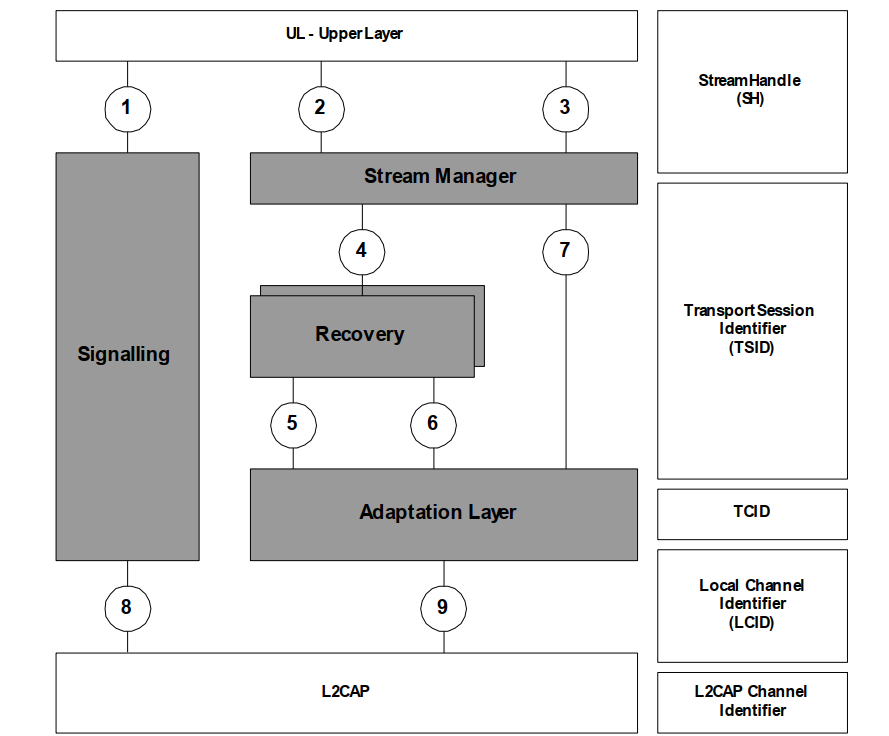
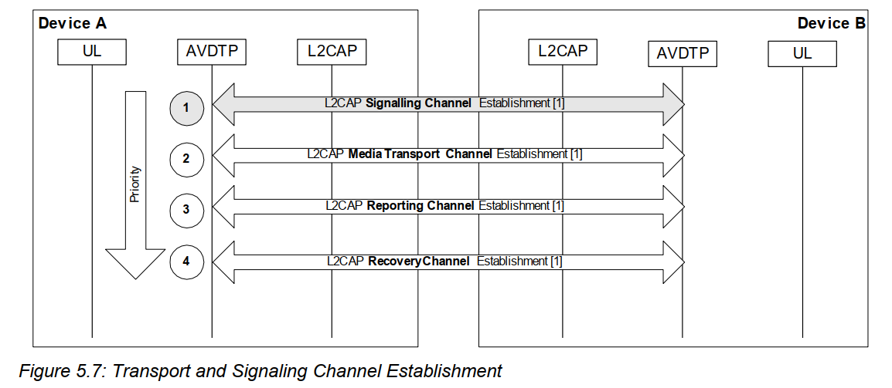
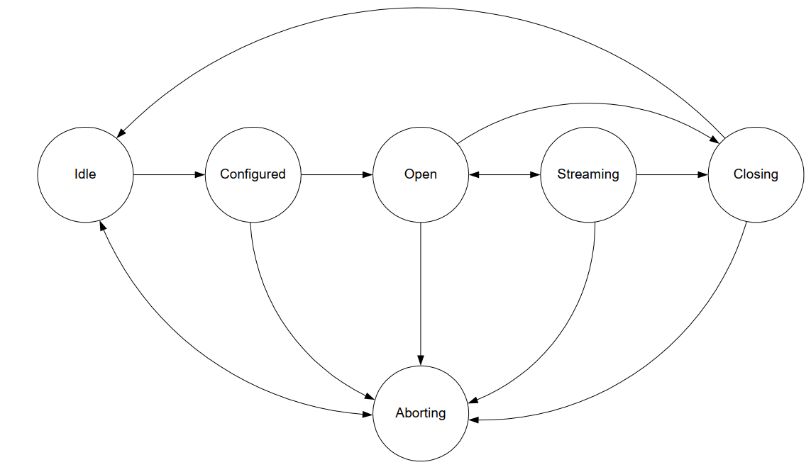
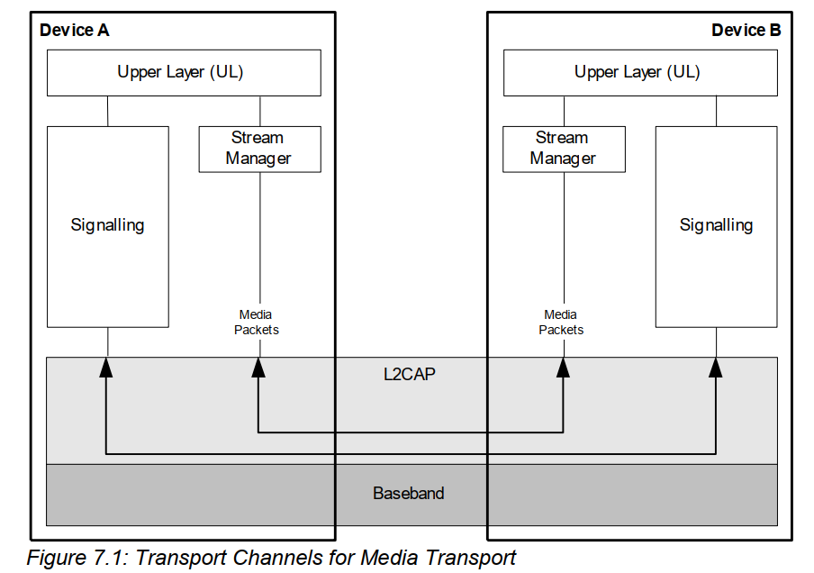

# AVDTP 学习

avdtp 包含两个 l2cap channel (CID): 两个 CID 值不同；

- Signalling  

  提供avdtp 的协商，格式获取等等功能

- Media

  提供 packet 传输；重传，QoS 等功能；

adaptation layer 层：将多个 tsid 的session 复用成同一个  transport channel  ；

SEP 只能与一个对应的 SEP  进行连线；不允许有第三方插入连线；

至多会建立4 个 l2cap channel，即图上（1,5,6,7）各自用一个  CID；但是可以吧多个复用到统一 CID 进行传输；如图上所示；

下图为4个 CID 模型；

## state

## 术语

####  SEP： 

​	Stream End Point；即 sink 或者src 端，申明的注册信息；

####  SEID:   

​	Stream End Point Identifier ；每一个 SEP有一个 ID 值，src sink 之间连线时需要得知对方的SEID来进行连线；

#### TSID：

  Transport Session ：传输会话，每一个传输会话只能是   Media, Recovery, or Reporting packets. 的**一种；**

  Transport Session Identifier ；当一个 stream 中有多个传输会话是，在 packet header 中有一位 ID 用于标志是哪一个会话；仅在   Multiplexing Mode   模式下生效；跨设备，由 INT 端分配， ACP 端使用；

#### TCID  

  Transport Channel  ：抽象的传输通道， Multiplexing Mode 关闭时，仅能传输一路（media packet）会话；如果打开，可以传输多路；与 L2cap channel 对应；

  Transport Channel Identifier ，标志一个 Transport Channel ；仅 Multiplexing Mode 打开时有效；用来干嘛？？？难道一个 avdtp 连线中会有多个？

分析协议可知，双方先建立 Signalling  l2cap 连线，过程中协商要连线的 SEID；通过 Signalling  协商完成后，建立 media packet  L2cap 连线；即：a2dp start 是在 Signalling  中发送，而media packet 是在 media packet 中；在没有开启Multiplexing  的情况下，可以预料，如果一个 avdtp 上建立两个 a2dp 连线，那么media packet 会使用两个不同的 CID，但是 Signalling  只会是同一个；

