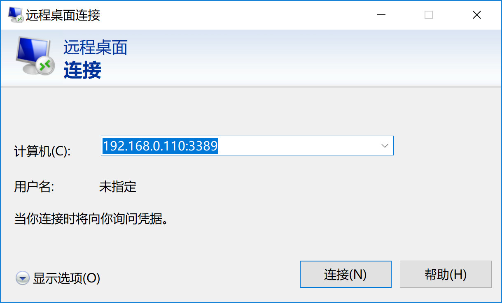
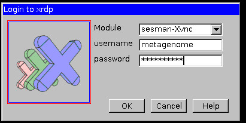
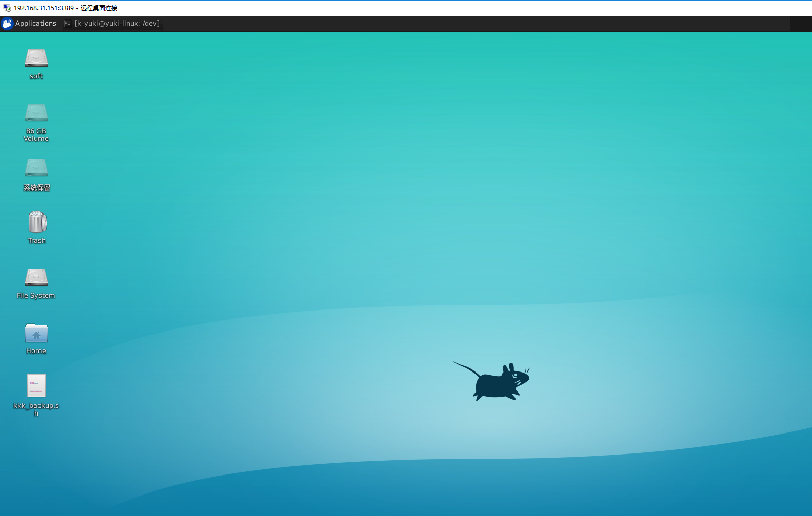
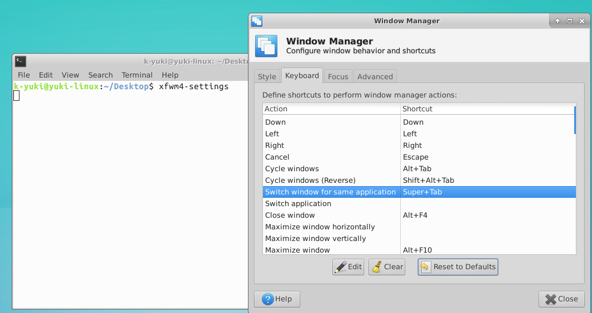

# windows 10 远程登录Ubuntu16.04

## Ubuntu端软件安装

1. 安装xrdp

```shell
sudo apt-get install xrdp
```

2. 安装vnc4server

```shell
sudo apt-get install vnc4server
```

3. 安装xubuntu-desktop

```
sudo apt-get install xubuntu-desktop
```

4. 向xsession中写入xfce4-session(每个用户自己运行此行)

```
echo "xfce4-session" >~/.xsession
```

5. 开启xrdp服务

```
sudo service xrdp restart
```

## windows 端访问

电脑远程登录：Ip为Ubuntu 的ip，端口号为3389





注：此处用户名和密码即为Ubuntu 的账户名和密码；

登录后界面如下：



## 远程桌面终端中table 键无效的解决方法

1. 在远程桌面终端中执行命令：

```sh
xfwm4-settings
```

2. 在弹出的窗体中选择keyboard， 下面找到“switch window for same application”，将后面的快捷键clear掉；退出即可；


