# zebu 环境搭建

1、登陆网址  <http://citrix.sunplus.com/Citrix/XenApp/site/default.aspx>   （hiu工作站）

​		账户：C00963 

​		密码：默认记忆，TODO

​		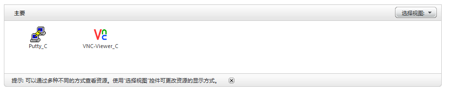

2、点击： putty.c， 打开

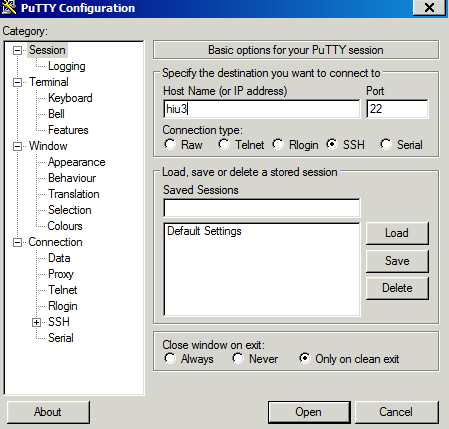

如图填写红Host Name，点击 open 

登陆账户：c00963

登陆密码：c00963@123

3、在终端输入

`vncserver  -geometry  1280x960 -depth 24`

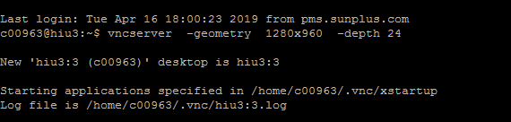

记住其中 hiu3:3 

4、回到网页，打开 VNC_viewr.c

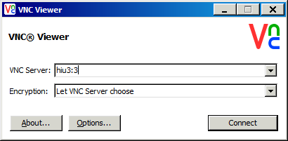

​		点击 connect

​		密码：sunplus    注：此密码会在第一次登陆时要求设置；

登陆界面如下：

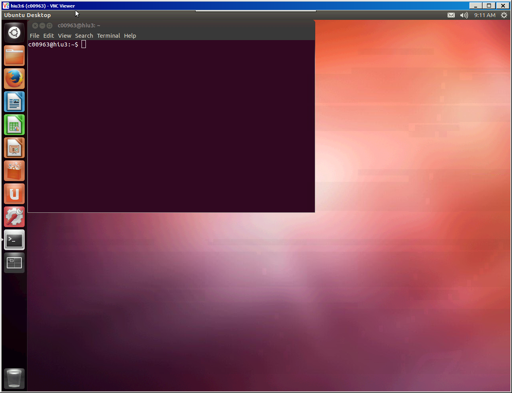


5、登陆网页：http://citrix-rdse.sunplus.com/Citrix/XenApp/site/default.aspx (VNC 工作站)

​	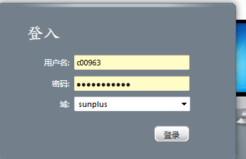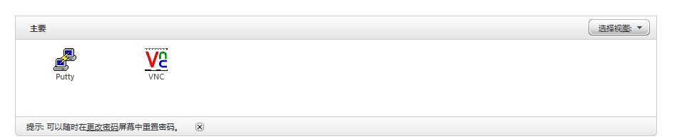

6、点击putty，此处服务器选择 vnc3

​	登陆账户： c00963

​	登陆密码： c00963@123

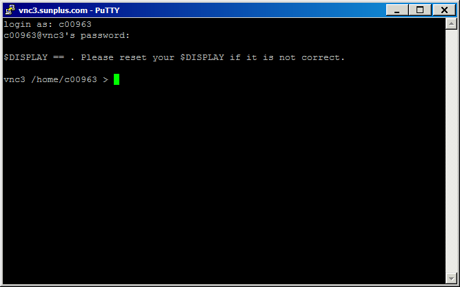

​	在终端输入： 

```
vncserver  -geometry  1280x960 -depth 24
```

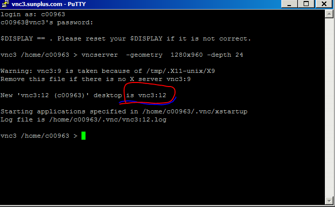

6、回到网页，打开VNC，此处server 的值为之前终端中的值

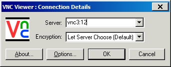

​	登陆密码: sunplus

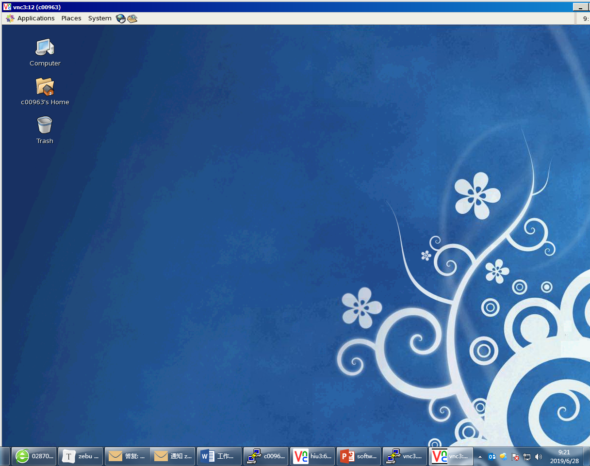


# zebu的使用

1、在 RD(VNC) 工作站上

```
gm -a diah145  // 不执行此命令会没有权限进入 /home/diah145 目录
cd /home/diah145/zebu
mkdir cj.xu
cd cj.xu
```

设置svn 下载免密码，方法参见：http://wiki2.sunplus.com/dvdsa/index.php/%E6%8A%93SVN%E5%85%8D%E5%AF%86%E7%A0%81%E8%BE%93%E5%85%A5

密码为： c00963@123  (即账号密码)

下载 svn 环境：

```
svn co svn+ssh://websvn1/project/I145/ver_A/ASIC
```

运行zebu 服务器：

```

rsh rzebu10 (此处选择zebu 10)
cd ASIC/zebu_sim/
./run_sim                //或者使用 ./run_sim old， 此时跑的旧的运行环境；
```

2、在SA（HIU）工作站上：

​	下载popoto 代码，编译，方法参见：popoto_at_zebu.pdf，注意是使用台湾的地址来下载；

编译好hex 档案后，将其传到RD 上：

方法：在SA 内，打开 filezilla 软件

host: ri60， username： coo963, password: c00963@123

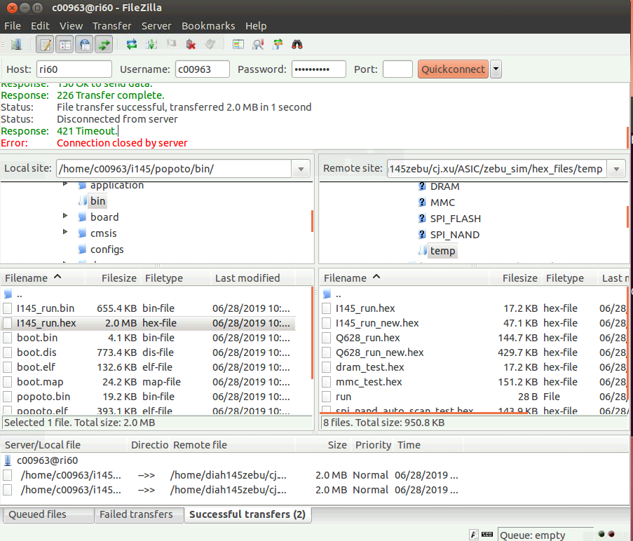

拷贝 popoto/bin/i145_run.hex ---> ASIC/zebu_sim/hex_file/temp

### 波型抓取：

```
./run_sim old dump
make fsdb
make verdi
```

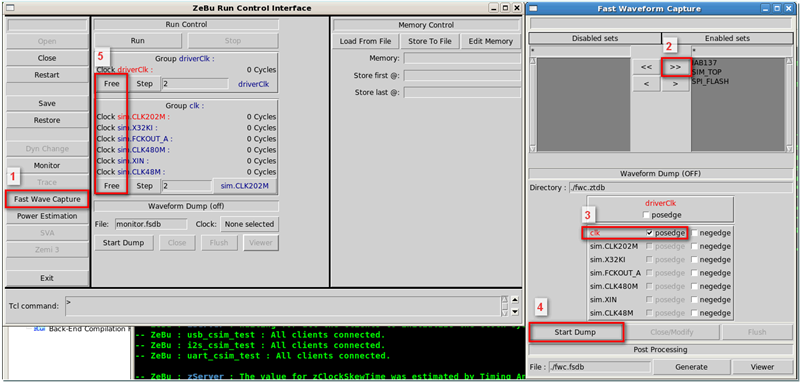

# 备忘资料

C00961 許明春
C00962 李奎
C00963 徐昌杰
C00964 盧遜
C00965 徐萍
C00966 胡雪梅

PW : @sunplus123

帳號已經建立, 密碼與使用工作站如下:
帳號                         Password                工作站
c00961 許明春       c00961@123           hiu1
c00962 李奎           c00962@123           hiu2 
c00963 徐昌杰       c00963@123           hiu3
c00964 盧遜           c00964@123           hiu4
c00965 徐萍           c00965@123           hiu5
c00966 胡雪梅       c00966@123           hiu4
若user 需要更改password : 請用 yppasswd 更改

### 脚本命令：

如果桌面没有出来：

```
setenv DISPLAY vncXX:x   //vncxx:x 即为vnc 的服务器编号
xhost +
```

8128 git 地址：

```
172.23.3.34
```

popoto 环境配置：

```
cd popoto
. env.sh   //如果使用dsp,执行命令：DSP=1 && . env.sh
make zebu
make && make boot && make pkg

修改配置：
*IV_MX0 = b1;
*IV_MX2 = b1;
```

zebu 更换工作站：

```
hrm & //查看各个工作站的使用情况
rlogin ri60   //切换到 ri60 工作站
```

usb PDE filezilla 连接SA 服务器：

地址：172.23.3.177

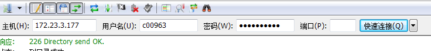

### 资料网址

<http://citrix.sunplus.com/Citrix/XenApp/site/default.aspx>   （hiu工作站）

<http://citrix-rdse.sunplus.com/Citrix/XenApp/site/default.aspx>  （vnc工作站）

http://wiki2.sunplus.com/dvdsa/index.php/SPHE8128/I145:Validation_List  （wiki 资料）

http://wiki2.sunplus.com/dvdsa/index.php/SPHE8128/I145:Status#Zebu_.E9.A9.97.E8.AD.89.E7.8B.80.E6.85.8B

http://psweb.sunplus.com.tw/mantis_PD2/view.php?id=8576

http://wiki2.sunplus.com/wiki/index.php/IP-Spec:UART0_QAY429S //uart

http://wiki2.sunplus.com/wiki/index.php/IP-Spec:GDMA //gdma

http://psweb.sunplus.com.tw/mantis_PD2/view.php?id=8576

http://psweb.sunplus.com.tw/mantis_PD2/view.php?id=8576

http://wiki2.sunplus.com/wiki/index.php/I145/ver_A:Programming_Guide#Memory_Map