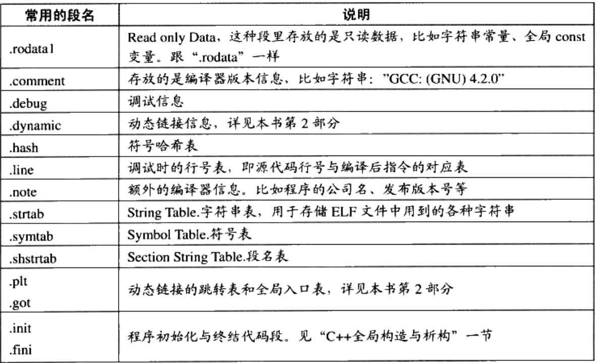
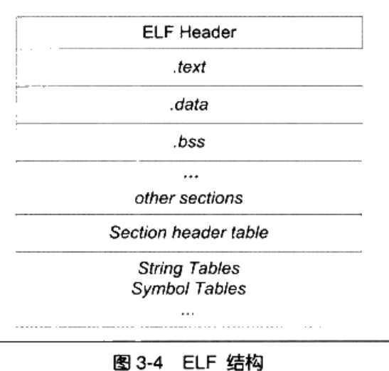

# 程序员的自我修养

### 一、gcc:

```
gcc -E test.c
	-->预处理：
	-->打印出预编译后的结果：即去掉注释，加入头文件等等；生成.i 文件
```

```
gcc -S test.c**
	-->汇编
	-->生成.s 文件，即汇编指令
```

```
gcc -s test.c
	-->只编译，不装载和链接， 生成a.out
```

```
gcc -c test.
	-->生成test.o 二进制可重定位文件。
```

## 二、objdump 的使用：

**objdump -h**   显示出ELF 文件的分段信息：

```
Sections:
Idx Name          Size      VMA               LMA               File off  Algn
0 .text         00000095  0000000000000000  0000000000000000  00000040  2**0
CONTENTS, ALLOC, LOAD, RELOC, READONLY, CODE
1 .data         00000004  0000000000000000  0000000000000000  000000d8  2**2
CONTENTS, ALLOC, LOAD, DATA
2 .bss          00000004  0000000000000000  0000000000000000  000000dc  2**2
```

**objdump -x**  显示更多信息；

**objdump -s**  以16 进制的形式显示elf 档案中的各个段的信息；

**objdump -d** 显示 text 段的反汇编；

**objdump -r**  显示elf 中的符号表；

```
objdump	-a   显示档案成员信息，类似ls -l 将lid*.a的信息列出
objdump	-d   从objfile中反汇编那些特定指令机器代码
objdump	-f   显示objfile 中每个文件的整体头部摘要信息
objdump	-r   显示文件的重定位入口
objdump	-s   显示指定section的完整内容
objdump	-S   尽可能反汇编出源代码
objdump	-t   显示文件的符号表入口
```


## 三、readelf

​	**readelf -h xxx.o** 显示elf 的header 信息：

```
readelf -h a.out 
ELF 头：
  Magic：   7f 45 4c 46 02 01 01 00 00 00 00 00 00 00 00 00 
  类别:                              ELF64
  数据:                              2 补码，小端序 (little endian)
  版本:                              1 (current)
  OS/ABI:                            UNIX - System V
  ABI 版本:                          0
  类型:                              DYN (共享目标文件)
  系统架构:                          Advanced Micro Devices X86-64
  版本:                              0x1
  入口点地址：               0x850
  程序头起点：          64 (bytes into file)
  Start of section headers:          6616 (bytes into file)
  标志：             0x0
  本头的大小：       64 (字节)
  程序头大小：       56 (字节)
  Number of program headers:         9
  节头大小：         64 (字节)
  节头数量：         29
  字符串表索引节头： 28
```

**readelf -S xxx**  查看elf 档案的段表信息

**readelf -s xxx**  查看elf 档案的符号信息，如函数名，变量名（全局）等等；

​	与 nm xxx 类似，但是内容更加详细；

```
readelf -s bin_seg.o       

Symbol table '.symtab' contains 20 entries:
   Num:    Value          Size Type    Bind   Vis      Ndx Name
     0: 0000000000000000     0 NOTYPE  LOCAL  DEFAULT  UND 
     1: 0000000000000000     0 FILE    LOCAL  DEFAULT  ABS bin_seg.c
     2: 0000000000000000     0 SECTION LOCAL  DEFAULT    1 
     3: 0000000000000000     0 SECTION LOCAL  DEFAULT    3 
     4: 0000000000000000     0 SECTION LOCAL  DEFAULT    4 
     5: 0000000000000000     0 SECTION LOCAL  DEFAULT    5 
     6: 0000000000000000     0 SECTION LOCAL  DEFAULT    7 
     7: 0000000000000000     0 SECTION LOCAL  DEFAULT    8 
     8: 0000000000000000     0 SECTION LOCAL  DEFAULT    6 
     9: 0000000000000020   400 OBJECT  GLOBAL DEFAULT  COM a2dp
    10: 0000000000000000   264 FUNC    GLOBAL DEFAULT    1 main
    11: 0000000000000000     0 NOTYPE  GLOBAL DEFAULT  UND _binary_music_mp3_start
    12: 0000000000000000     0 NOTYPE  GLOBAL DEFAULT  UND _GLOBAL_OFFSET_TABLE_
    13: 0000000000000000     0 NOTYPE  GLOBAL DEFAULT  UND puts
    14: 0000000000000000     0 NOTYPE  GLOBAL DEFAULT  UND _binary_music_mp3_size
    15: 0000000000000000     0 NOTYPE  GLOBAL DEFAULT  UND _binary_music_mp3_end
    16: 0000000000000000     0 NOTYPE  GLOBAL DEFAULT  UND printf
    17: 0000000000000000     0 NOTYPE  GLOBAL DEFAULT  UND open
    18: 0000000000000000     0 NOTYPE  GLOBAL DEFAULT  UND write
    19: 0000000000000000     0 NOTYPE  GLOBAL DEFAULT  UND exit
```

```
 nm bin_seg.o 
0000000000000190 C a2dp
                 U _binary_music_mp3_end
                 U _binary_music_mp3_size
                 U _binary_music_mp3_start
                 U exit
                 U _GLOBAL_OFFSET_TABLE_
0000000000000000 T main
                 U open
                 U printf
                 U puts
                 U write
```

**readelf -l a.out:** 查看elf 的虚拟内存与文件段地址的映射关系

```
		readelf -d Lib.so   显示动态段的信息
		readelf -r Lib.so   显示可重定位段信息
		readelf -S Lib.so   显示节头信息
		readelf -s Lib.so   显示符号段中的项
		readelf -a Lib.so   显示全部信息
```


## 四、ELF 文件

ELF（executeble linkable format） 是Linux 环境下的可执行文件格式；链接库也按照此格式存储；

| ELF 文件类型                       | 说明                                                         | 实例                |
| ---------------------------------- | ------------------------------------------------------------ | ------------------- |
| 可重定位文件（relocation File）    | 包含了数据与代码，可以用来链接成可执行文件或共享文件，静态链接库也属于这一类 | .o 文件，.a 文件    |
| 可执行文件（executable file）      | 可以直接执行                                                 | a.out               |
| 共享目标文件（shared object Flie） |                                                              | .so、.dll           |
| 核心转储文件（core dump file）     |                                                              | Linux 下的core dump |

使用file 可以看到相应文件的格式：

**file bin/getsub**

```

bin/getsub: ELF 64-bit LSB executable, x86-64, version 1 (SYSV), dynamically linked, interpreter /lib64/l, for GNU/Linux 2.6.32, BuildID[sha1]=fa7337b8fd2674c43213694f455ae486caa862e3, not stripped
```

**file libdemo.so** 

```
libdemo.so: ELF 64-bit LSB shared object, x86-64, version 1 (SYSV), dynamically linked, BuildID[sha1]=78731df1f608207829b71952ad76fa304718fcd2, with debug_info, not stripped
```

### BSS 段

BSS(Block Started bySymbol)：意为“以符号开始的块”， 在二进制文件中不存在；只是为未初始化的全局变量和未初始化的静态变量（包括局部静态变量）预留位置；

注：在Ubuntu 18.04 64 位环境下，static（无论是否全局）与 全局变量如果被初始化为0，都会放到bss 段；

可以使用 **objdump -s obj.o** 查看某一个ELF文件中的各个段的hex 数据；同时也可以使用**size** 命令获取elf 文件中的各个段的大小；

注：直接 **size obj.o** 这种形式查看出来的text 段大小与 **objdump -s** 获取出来的大小不同，是因为**size**默认是运行在"**Berkeley compatibility mode**"下。在这种模式下，会将不可执行的拥有"ALLOC"属性的只读段归到.text段下，很典型的就是.rodata段。如果你使用"**size -A obj.o**"，那么size会运行在"System V compatibility mode"，此时，用**objdump -h**和size显示的.text段大小就差不多了。





段表：
		使用readelf -S test.o 可以查看。注： 使用objdump -h 显示的结果是不完整的；
		段表是一些列的elf_shdr 结构体的数组。数组的第一个元素为无效段。数组的元素个数即elf  header 中记录的段的数量。
		elf_shdr 结构体记录了每一段的段名（这里只记录了偏移值，即真正的段名字符串在端.shstrtab 中）；段的类型，
		该段在文件中的偏移，大小等等信息；

字符串表：由于字符串长度一般不固定，所以把字符串放到一个固定段中，其他地方引用字符串时，只需要引用其在字符串表中的offset 即可
	字符串表一般有两个段：
		.strtab: 记录普通的符号名： 如变量名称等等。注：代码中的常量字符串是放在字符串常量区的，不是在这里。
		.shstrtab: 记录段的名字，这个即上文提到的段表字符串表。
综上所述： 识别elf 的每一段信息的方法为;
1、读取elf 文件， 解析出elf header，找到段表的位置，段对个数，段表中段表字符串段的下表。
2、跳到段表的位置，根据段表字符串的下标找到段表字符串段的位置；
3、根据段表和段表字符串段的数据，计算出每一段的size， offset和名字。
注：段表一般在文件之后，即顺序一般为: elf header--.text--.data...--段表。
那么计算文件长度的方法为：段的起始位置offset + （段的数量 * 每个段表元素的大小）
		这三者都可以从elf header 中获取。


## 五、装载

### 1、程序的建立

- ​	创建一块独立的虚拟空间
- ​	读可执行文件头，为虚拟空间与可执行文件建立映射关系
- ​	将CPU 指令寄存器设置为可执行文件的入口地址，启动运行

生成动态库：

```s
gcc -fPIC -shared -o Lib.so Lib.c
```

**链接时重定位**

​	在编译目标文件时，不会直接写死符号的绝对地址，而是以偏移地址；在链接时才会决定符号的绝对地址；静态库使用；

**装载时重定位：**

​	在链接时也不确定符号地址，而是在装载时去决定；编译动态库时，如果使用 `-shared` 而不使用 `-FPIC`，目标文件便是使用的这种方式；

**-FPIC**

​	动态库装载时重定位的问题：指令部分无法在多个进程之间共享；使用 `-FPIC`， 生成地址无关码（position independent code）：将指令中需要修改的部分抽出来，和数据放到一起，剩下的指令则指明绝对地址，其不会在装载时发生变化；这样可以实现多个进程中共用一份指定，而独自有一份需要修改的指令和数据的副本，达到省mem 的目的；

判断一个.so 是否为 PIC

`readelf -d foo.so | grep TEXTREL`

如果有输出，则说明不是；因为 PIC 的目标文件是不会包含任何重定位表的；


## 六、nm

显示目标文件中的符号；

| 符号类型 | 说明                                     |
| -------- | ---------------------------------------- |
| A        | 该符号是绝对值，在链接过程中不会发生变化 |
| b/B      | 出现在BSS 段的符号                       |
| U        | 未定义符号                               |
| u        | 全局唯一符号                             |
| V/v/W/w  | 弱符号，弱对象                           |


## 七、运行时动态库定位规则

正常情况下，在链接时，使用 `-L` 来指明链接时库的位置， `-l` 来指明需要链接哪些库； 其中  `-L` 仅在链接时生效，而 `-l`  则会在装载时去搜寻相应的lib(一般根据环境变量 `LD_LIBRARY_PATH`)；

#### 1、使用 `-rpath` 在链接时指明运行时lib 的位置；

如: 链接 main.o 生成 a.out 需要当前目录下的liba.so

正常链接流程： 

```
gcc main.o  -L./ -la
```

如果此时没有将当前目录加到链接库的环境变量中，那么运行 a.out 会找不到 liba.so；

加上 `-rpath`  (与 `-R` 等价)

```
gcc main.o -Wl,-R ./ -L./ -la
```

在运行时，会自动找到当前目录去加载 liba.so

使用 readelf -d a.out 查看：

```
Dynamic section at offset 0xda0 contains 29 entries:
  Tag        Type                         Name/Value
 0x0000000000000001 (NEEDED)             Shared library: [libd.so]
 0x0000000000000001 (NEEDED)             Shared library: [libc.so.6]
 0x000000000000001d (RUNPATH)            Library runpath: [./]
 0x000000000000000c (INIT)               0x5f0
 0x000000000000000d (FINI)               0x804
 0x0000000000000019 (INIT_ARRAY)         0x200d90
 0x000000000000001b (INIT_ARRAYSZ)       8 (bytes)
```

其中 `RUNPATH`  字段记录了定位lib 的位置；

objdump -f a.out

### 2、chrpath

可以使用工具 charpath 在可执行档案生成之后，修改  RUNPATH 的值；注意：其可以清空，删减该字段，但不能插入该字段；

## 八、其他工具

**file:查看文件类型的详细信息；**

**size: 获取 elf 中各个段的长度**

**ldd：显示可执行档的加载项**

 等价于 `readelf -d a.out | grep NENDED `