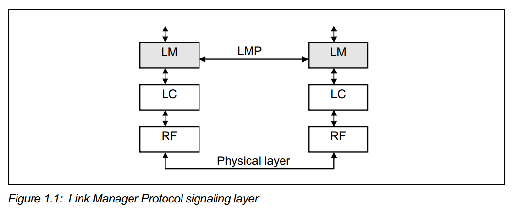
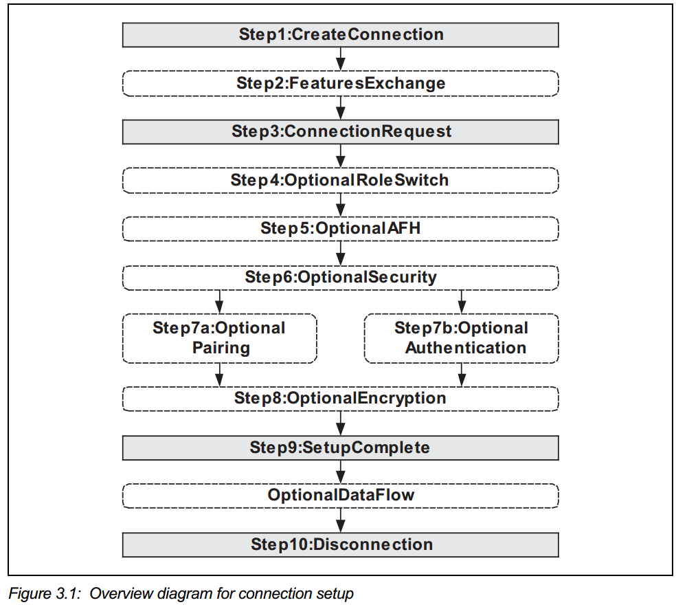

# 蓝牙学习笔记

### clock

- 蓝牙时钟为 3.2 KHZ，所以最小单位为 1000000/3200 = 312.5 us（半个 slot）；

### addr

-  蓝牙地址分为三部分： LAP(24位地址低端部分)、UAP(8位地址高端部分)和NAP(16位无意义地址部分)。 
- 其中,NAP和UAP是生产厂商的唯一标识码，必须由蓝牙权威部门分配给不同的厂商。 
- 而LAP是由厂商内部自由分配。
-  对于某一种型号的手机或者设备，所有个体的NAP、UAP是固定的，可变的是LAP。 

-  保留地址 0x9E8B00-0x9E8B3F（仅 LAP 部分变化）. 通用 inquiry 地址 0x9E8B33.   

### 跳频

- 跳频序列由地址的 LAP 和 UAP 决定，相位由时钟决定
- connect state 最大跳频频率为 1600 HZ(1000000 / 625， 即每个 slot 跳一下)
-  page/scan state 为 3200 HZ（page 时，master 一个 tx slot 跳频两次，发送两个 pkt)
- basic piconet physical channel ： 跳频序列由master  的地址和时钟决定，使用79 个 RF channel
- adapted piconet physical channel（至少使用 20 channel，slave 与 master 传输的 slot 频率相同 ）
- page scan physical channel： 跳频序列由被连线的设备地址确定
- inquiry scan physical channel
- synchronization scan physical channel
- 如果一个 packet 占据多个 slot，那么这几个 slot 频率与第一个 slot 相同

###    LOGICAL TRANSPORTS  

- Synchronous Connection-Oriented (SCO) logical transport

- Extended Synchronous Connection-Oriented (eSCO) logical transport

- Asynchronous Connection-Oriented (ACL) logical transport

- Active Slave Broadcast (ASB) logical transport

  The ASB logical transport is used by a master to communicate with active
  slaves. 

- Connectionless Slave Broadcast (CSB) logical transport. 

  The CSB logical transport is used by a master to send profile broadcast data to
  zero or more slaves. 

## 一、core 5.0 学习

### VOL2:

#### Part B:

5.1 SECURITY ARCHITECTURE

The Bluetooth security model includes five distinct security features: pairing,bonding, device authentication, encryption and message integrity.

> •Pairing: the process for creating one or more shared secret keys
>
> • Bonding: the act of storing the keys created during pairing for use in subsequent connections in order to form a trusted device pair
>
> • Device authentication: verification that the two devices have the same keys
>
> • Encryption: message confidentiality
>
> • Message integrity: protects against message forgeries 

##### 4: 逻辑传输

- Synchronous Connection-Oriented (SCO) logical transport

- Extended Synchronous Connection-Oriented (eSCO) logical transport

- Asynchronous Connection-Oriented (ACL) logical transport

- Active Slave Broadcast (ASB) logical transport

  The ASB logical transport is used by a master to communicate with active
  slaves. 

- Connectionless Slave Broadcast (CSB) logical transport. 

  The CSB logical transport is used by a master to send profile broadcast data to
  zero or more slaves. 

### LMP

#### 4.2 SECURITY

###### 4.2.1 Authentication 

Two authentication procedures are defined: legacy and secure authentication.
Legacy authentication shall be performed when at least one device does not
support both the Secure Connections (Controller Support) and Secure
Connections (Host Support) features and the local device allows legacy
authentication to be used. Secure authentication shall be performed when both
devices support the Secure Connections (Controller Support) and Secure
Connections (Host Support) features  

Both the master and slave LM act as verifier and claimant. The initiator is the
device that sends the LMP_au_rand PDU first. 

4.2.7 Secure Simple Pairing
There are four stages defined in the Secure Simple Pairing LM process:
• IO capabilities exchange
• Public key exchange
• Authentication stage 1
• Authentication stage 2 

Three algorithms have been specified: Numeric

- comparison
- Passkey entry
- Out of band 

carrying the ACL-C logical link for LMP
messages and the ACL-U logical link for L2CAP data 

### HCI

• BR/EDR Controller
• BR/EDR/LE Controller
• LE Controller
• AMP Controller 

### 名词简写

- Channel Quality Driven Data Rate Change (CQDDR) 
- Quality of Service (QoS) 
- Slot Availability Mask (SAM)
- Authenticated Ciphering Offsets (ACOs)
- Protocol Data Units (PDU) 
- Host Controller Interface (HCI) 
- Link Manager (LM) 
- Service Data Unit (SDU)
- Maximum Transmission Unit (MTU) 
- Maximum PDU payload Size (MPS) 
- channel identifier (CID) 
- Protocol/Service Multiplexer (PSM) 

### 问题记录：

1、LMP 是协议，ACL 是链路连接；那么两者是什么关系；LMP 是跑到  ACL-C l 上面的；那么是一开始 ACL 连接就建立好了吗？通过抓包发现，第一条包是master 发出的 LMP 的 features_req；这一条是什么链路发过来的？从log看，ACL connect complete event 是在后来（鉴权的时候）才通过hci 发给host 的，难道是这个时候 ACL 才会建立好吗？

2、鉴权，ACL 链路的建立需要host 去管理吗？还是说btc 本身就会建立好；鉴权是会有event 通知HOST 是否接受；spec 中有提到对方请求建立 ACL 链接时会有event 通知host，但是在 M4 没有发现这种情况， SCO 倒是有；

3、l2cap 是建立在 ACL 之上的， RFCOMMON 是在l2cap 之上，spp 在RFCOMMON 上；那么多条spp 公用同一条RFCOMMON 吗？ L2cap 呢？acl 呢；

--> l2cap 是一个抽象的概念，并不是一个实体；一个 host 只有一个 l2cap，这里面分配管理了与各个远端 entry 连续的 CID；

# 其他记录：

## 1、device class 解析；

详见官方资料： https://www.bluetooth.com/specifications/assigned-numbers/baseband/

device class 有3 byte（24 bit）;

注：bit 从0 开始计算；

其中[13:23] 11 bit 为 Major Service Classes，相应的bit 为1 则代表支持相应的功能：

| Bit No. | Major Service Class                                       |
| ------- | --------------------------------------------------------- |
| 13      | Limited Discoverable Mode [Ref #1]                        |
| 14      | (reserved)                                                |
| 15      | (reserved)                                                |
| 16      | Positioning (Location identification)                     |
| 17      | Networking (LAN, Ad hoc, …)                               |
| 18      | Rendering (Printing, Speakers, …)                         |
| 19      | Capturing (Scanner, Microphone, …)                        |
| 20      | Object Transfer (v-Inbox, v-Folder, …)                    |
| 21      | Audio (Speaker, Microphone, Headset service, …)           |
| 22      | Telephony (Cordless telephony, Modem, Headset service, …) |
| 23      | Information (WEB-server, WAP-server, …)                   |

[8:12] 5 bit 为 Major Device Classes，其含义如下：

| 12   | 11   | 10   | 9    | 8    | Major Device Class                                           |
| ---- | ---- | ---- | ---- | ---- | ------------------------------------------------------------ |
| 0    | 0    | 0    | 0    | 0    | Miscellaneous [Ref #2]                                       |
| 0    | 0    | 0    | 0    | 1    | Computer (desktop, notebook, PDA, organizer, … )             |
| 0    | 0    | 0    | 1    | 0    | Phone (cellular, cordless, pay phone, modem, …)              |
| 0    | 0    | 0    | 1    | 1    | LAN /Network Access point                                    |
| 0    | 0    | 1    | 0    | 0    | Audio/Video (headset, speaker, stereo, video display, VCR, … |
| 0    | 0    | 1    | 0    | 1    | Peripheral (mouse, joystick, keyboard, … )                   |
| 0    | 0    | 1    | 1    | 0    | Imaging (printer, scanner, camera, display, …)               |
| 0    | 0    | 1    | 1    | 1    | Wearable                                                     |
| 0    | 1    | 0    | 0    | 0    | Toy                                                          |
| 0    | 1    | 0    | 0    | 1    | Health                                                       |
| 1    | 1    | 1    | 1    | 1    | Uncategorized: device code not specified                     |
| X    | X    | X    | X    | X    | All other values reserved                                    |

[0:7] 8bit 为 The Minor Device Class field，其含义根据 Major Device Classes 的不同有所不同；具体参考官方文档；

以8128 的device class 为例：

 8128 的class device 为：0x200418 （‭0010 0000 0000 0100 0001 1000‬）：

Major Service Class 中，其【21】为1， 即支持的Service 为 ：Telephony (Cordless telephony, Modem, Headset service, …)；

Major Device Class 中，其【10】 为1， 即为 Audio/Video (headset, speaker, stereo, video display, VCR, …；

Minor Device Class 中，其【3::4】为，即为 Headphones；